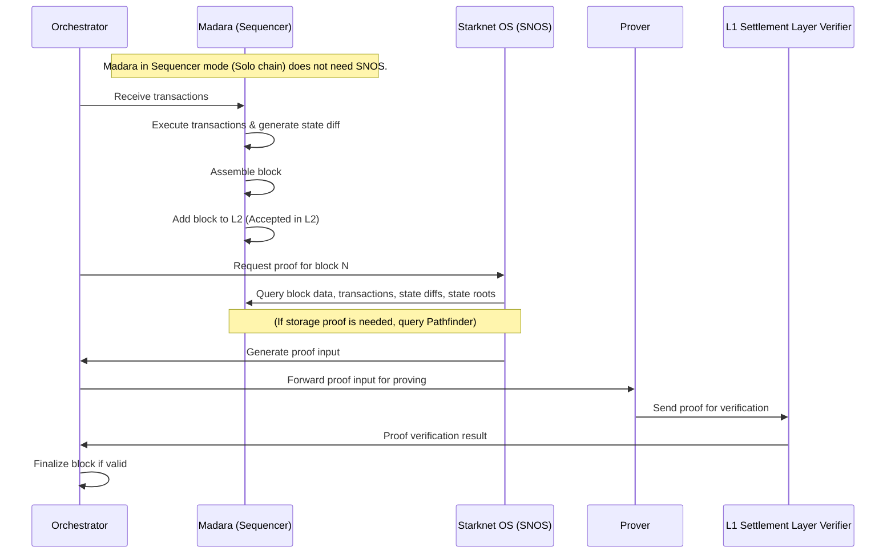

# Architecture

A Madara blockchain consists of the following components:
- An orchestrator
- A sequencer
- Starknet OS (SNOS)
- A prover
- A settlement layer

Note that some components are left out, for now, for simplicity.

## Transaction flow

When a user issues a transaction it goes through the components in the following way:
1. The transaction is received by the orchestrator
1. The orchestrator assigns the transaction to the sequencer
1. The sequencer executes the transaction and generates a state diff (depicting what state changes the transaction causes in the blockchain)
1. The sequencer waits until enough transactions have been received to formalize a block
1. The sequencer assigns "Accepted in L2" status to all of the block's transactions
1. Meanwhile, the Orchestrator requests proof inputs from the Starknet OS (SNOS)
1. When receiving such request, the SNOS starts polling the sequencer for a ready block and its related data
1. Once the block data has been handed to SNOS, it generates input for the validity proof for the orchestrator
1. The orchestrator forwards the proof inputs to the prover
1. The prover generates a validity proof and forwards this to the settlement layer verifier contract
1. The orchestrator monitors the verifier contract and finalizes the block if the proof is valid.

