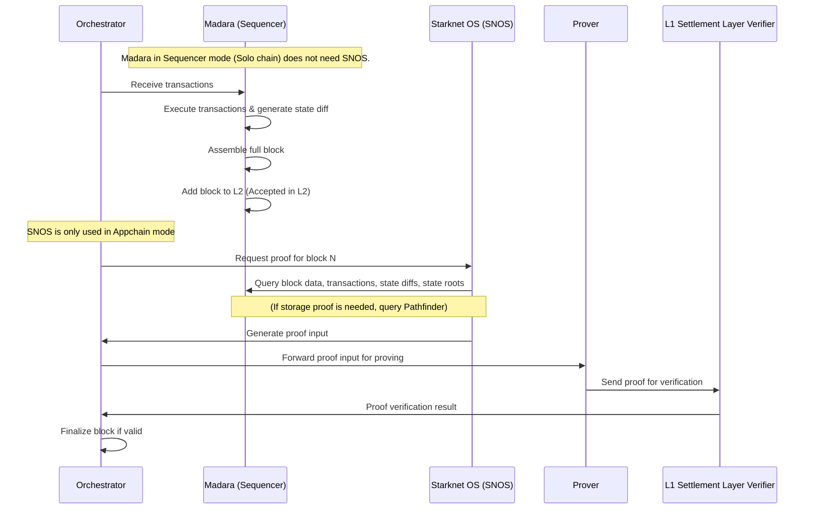

# Architecture

A Madara blockchain consists of the following components:
- A gateway
- A sequencer
- An orchestrator
- Nodes
- Starknet OS (SNOS)

Furthermore, the following parties should be present:
- Users issuing transactions
- A data availability layer
- A settlement layer
- A prover

## Transaction flow

TODO: the text is incorrect, the image is closer to reality. fix the text

When a user issues a transaction it goes through the components in the following way:
1. The transaction is received by the gateway and is forwarded to the orchestrator
1. The orchestrator assigns the transaction to the sequencer
1. The sequencer adds the transaction to a block
1. Once a block is ready, the sequencer executes the block using Starknet OS (SNOS), which generates an execution trace and state diffs (depicting what state changes the block's transactions caused in the blockchain)
1. The sequencer publishes the block's transaction data and state diffs to a Data Availability (DA) layer.
1. The sequencer forwards the block's execution trace to a prover
1. The prover generates a cryptographic proof of correctness of the block. 
1. The proof is sent to the L1 Settlement Layer verifier contract for verification.
1. The orchestrator monitors the L1 verifier contract and finalizes the block if the proof is valid.

