# Architecture

A Madara [Appchain](/concepts/appchain) consists of the following components:
- An [orchestrator](orchestrator)
- A [sequencer](nodes)
- [Starknet OS](starknet_os) (SNOS)
- A [prover](prover)
- A [settlement layer](/concepts/settlement)

Note that some components are left out, for now, for simplicity.

## Transaction flow

When a user issues a transaction it goes through the components in the following way:
1. The transaction is received by the sequencer
1. The sequencer executes the transaction and generates a state diff (depicting what state changes the transaction causes in the blockchain)
1. The sequencer waits until enough transactions have been received to assemble a block
1. Meanwhile, the Orchestrator polls the sequencer for new, unprocessed blocks
1. Once a new, unprocessed block is available, a request is sent to SNOS to process the block number
1. SNOS queries the sequencer for block data (transactions, state diff, old state root, new state root), based on the block number
1. The sequencer returns block data for the SNOS
1. The SNOS generates and sends validity proof input for the orchestrator
1. The orchestrator forwards the validity proof inputs to the prover
1. The prover generates a validity proof and forwards this to the settlement layer verifier contract
1. The orchestrator monitors the verifier contract for block verification
1. Once the block has been verified, the orchestrator requests the settlement layer's core contracts to update the network state
1. The sequencer monitors the core contracts for a new, updated state and updates its own state accordingly

```mermaid
sequenceDiagram

    participant Sequencer as Madara (Sequencer)
    participant Orchestrator
    participant SNOS as Starknet OS (SNOS)
    participant Prover
    participant Verifier as Settlement Layer

    Sequencer ->> Sequencer: Execute transactions & generate state diff
    Sequencer ->> Sequencer: Assemble block

    Orchestrator ->> Sequencer: Get unprocessed block

    Orchestrator ->> SNOS: Ask for proof input
    SNOS ->> Sequencer: Query block data, transactions, state diffs, state roots
    Sequencer ->> SNOS: Return requested data
    SNOS ->> Orchestrator: Return proof input
    
    Orchestrator ->> Prover: Send proof input for proving
    Prover ->> Verifier: Send proof for verification
    Verifier ->> Orchestrator: Proof verification result

    Orchestrator ->> Verifier: Update state
    Verifier ->> Sequencer: Latest accepted block number

    Sequencer ->> Sequencer: Update state and finalize block ✅
```

