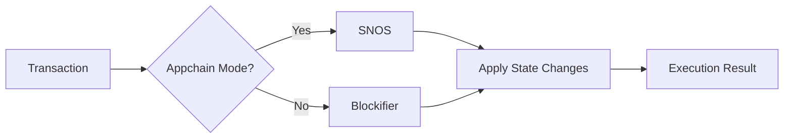

# Types of Nodes

## Overview

Running an Appchain requires multiple components to handle different aspects of the network. Nodes play a crucial role by maintaining blockchain state, synchronizing with other nodes, and providing access to users and applications.

## Node capabilities

Madara nodes have two primary capabilities:
- Full Node. Maintains blockchain state and history.
- Sequencer. Participates in transaction ordering and block production.

The exact functionality of these capabilities is explained in the following sections.

### Full node

A full node stores the entire state of the blockchain and validates transactions.

Whenever the node receives new transactions and blocks it validates them to make sure they follow the network's rules. Invalid data is not accepted.

#### Archive node

An archive node is a full node that retains all historical data needed to recreate any historical state.

Full nodes may sometimes be configured to prune old data to save disk space. Madara full nodes also act as archive nodes.

#### RPC API

Full nodes often expose a public-facing [RPC API](https://github.com/starkware-libs/starknet-specs/blob/master/starknet_vs_ethereum_node_apis.md). This can be utilized by users to access the Appchain - to submit transactions and to read the Appchain state.

A non-sequencer node forwards transactions to a sequencer node but can still provide direct read access to the Appchain.

### Sequencer

A sequencer node is responsible for executing transactions and organizing them in a block. Transactions are typically received from full nodes. 

The sequencer checks each new transaction for the following conditions:
1. Is the transaction valid according to network rules.
1. Is the transaction ordered correctly (it's the next transaction in line from the originating account).
1. Is there space left in the current, pending block.

If all of the conditions are met, the transaction is executed and added to a pending block.

#### Mempool

Sequencers collect transactions submitted by users and order them into blocks. Pending transactions are kept in a queue. If the conditions mentioned above are not met, the transaction is kept in the mempool until it becomes valid or outdated (and is removed).

This queue is also called the *mempool*.

#### Execution

Transactions are executed in two different ways, depending on whether we are running a full Appchain or a solo chain / devnet.

In an Appchain, transactions are executed with [SNOS](/components/starknet_os). In a devnet, a component called blockifier is used.

Blockifier does simple transaction execution to calculate the state changes. On the other hand, SNOS provides much more data related to [proving](/components/prover). A devnet doesn't utilize a prover and can therefore utilize the simpler approach. Executing transactions through blockifier has much better performance.

#### Feeder Gateway

A feeder gateway is a collection of endpoints at the node that can be turned on or off. These are typically enabled in a sequencer.

These endpoints offer access to raw Appchain data. Full nodes can call these endpoints to synchronize their network state - these endpoints are not meant for end users or developers.

Gateways will get deprecated once direct, peer-to-peer communication becomes available in the SN Stack.

When talking about just the term *gateway*, it sometimes refers to the feeder gateway endpoint used for submitting transactions to a sequencer from a full node.

## State updates and synchronization

There are three main ways how a node receives new Appchain state information:
1. From other full nodes, during synchronization (valid only for full nodes).
1. From users issuing transactions (valid only for sequencers - either through full nodes or directly).
1. From the settlement layer proof verification contract (valid only for sequencers).

Once you start a new node from scratch, it will start synchronizing its state from a sequencer. But synchronization also happens continuously during normal node operations when the full node receives new blocks from the sequencer and it updates its own state accordingly.

Furthermore, once the settlement layer's proof has been verified, the node updates its state accordingly.

## Decentralization efforts

Currently, Madara Appchains (and the [SN Stack](https://www.starknet.io/sn-stack/) in general) support only one sequencer. All full nodes synchronize their state initially from this sequencer.

In the near future, multiple sequencers will be supported. At the same time, peer-to-peer protocols will be implemented and full nodes start to synchronize their state from other full nodes.

## Interacting with a node

Node clients are software that utilizes nodes. These can be divided in three categories:
1. Browser clients
1. Command-line interfaces
1. Developer clients

### Browser wallets

Several browser wallets exist for interacting with Madara Appchains and Starknet. They are built as browser extensions.

You can check the current options [here](https://www.starknet.io/wallets/).

### Command-line interfaces

Various developer tools exist to interact with Madara Appchains and Starknet. These tools are not beginner-friendly and are meant mostly for developers to quickly interact with the chain.

You can check the current options [here](https://docs.starknet.io/tools/devtools/interacting-with-starknet/).

### SDKs

These are various libraries and SDKs that allow developers to utilize nodes. They are typically embedded in other, larger systems that provide blockchain functionality for users.

## Read more

- [Starknet docs](https://docs.starknet.io/architecture-and-concepts/nodes/)