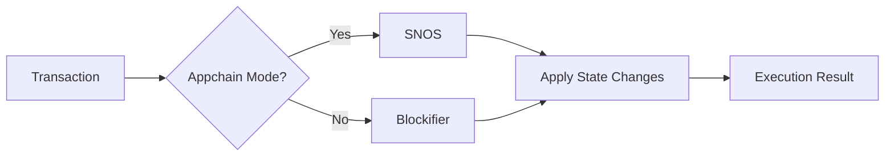

# Types of Nodes

## Overview

Running an Appchain involves significant computational and operational effort. This workload is distributed across various components.

Nodes help manage this workload by facilitating network synchronization and providing client access.

## Node capabilities

Madara nodes can be categorized based on four main capabilities:
| Capability | Description |
|------------|-------------|
| **Full Node** | Maintains complete blockchain state and history |
| **Sequencer** | Participates in transaction ordering and block production |
| **Gateway** | Exposes synchronization endpoints for other Madara nodes to connect and sync from |
| **Public-facing API** | An RPC API providing users access to the Appchain |

The exact functionality of the capabilities is explained a bit later. Any of these can be either turned on or off but the sequencer and gateway are useless without full node functionality. Furthermore, the public-facing API does not affect the node's logic.

Assuming the node has full node capabilities turned on, the options for sequencer and gateway variants are:

| Sequencer | Gateway | Explanation |
|:---------:|:-------:|------------------|
| ✅        | ✅      | A full sequencer node. |
| ✅        | ❌      | A sequencer node for block production. |
| ❌        | ✅      | A typical full node. |
| ❌        | ❌      | A typical archive node. |

### Full node

A full node stores the entire state of the blockchain and validates transactions.

Whenever the node receives new transactions and blocks it validates them to make sure they follow the network's rules. Invalid data is not accepted.

#### State updates

TODO: who executes? Who gets state updates and how

TODO: add state updates based on L1 proof verification

#### Archive node

An archive node is a full node that retains all historical data. 

Full nodes may sometimes be configured to prune old data to save disk space. By default, full nodes act also as archive nodes.

### Sequencer

A sequencer node is responsible for executing transactions and organizing them in a block.

Transactions are received from full nodes. If the sequencer acts also as a full node, it may receive new transactions directly from users.

Once a new transaction is received, the sequencer executes it. After that, the transaction is added to a pending block.

#### Execution

Transactions are executed in two different ways, depending on whether we are running a full Appchain or a solo chain / devnet.

In an Appchain, transactions are executed with [SNOS](/components/starknet_os). In a devnet, a component called blockifier is used.

Blockifier does simple transaction execution to calculate the state changes. On the other hand, SNOS provides much more data related to [proving](/components/prover). A devnet doesn't utilize a prover and can therefore utilize the simpler approach.

#### Cooperation with the orchestrator

The [orchestrator](/components/orchestrator) functions in close cooperation with the sequencer.

The orchestrator was initially separated from the sequencer to keep the sequencer as lightweight as possible. It was designed to handle much of the communication and coordination between various components.

### Gateway

A gateway is a collection of endpoints at the node. 

These endpoints offer access to raw Appchain data. Other full nodes can call these endpoints to synchronize their network state - these endpoints are not meant for end users or developers. 

Gateways will get deprecated once direct, peer to peer communication becomes available in the SN Stack.

Sometimes the term *feeder gateway* (or *fgw*), is used. This is the same as *gateway*.

### Public-facing API

Nodes may or may not expose a public-facing [RPC API](https://github.com/starkware-libs/starknet-specs/blob/master/starknet_vs_ethereum_node_apis.md). This can be utilized by users to access the Appchain - to submit transactions and to read the Appchain state.

A non-sequencer node forwards transactions to a sequencer node but can still provide direct read access to the Appchain.

## Node clients

Node clients are software that utilizes nodes. These can divided in three categories:
1. Browser clients
1. Command-line interfaces
1. Developer clients

### Browser clients

Several browser clients exist for interacting with Madara Appchains and Starknet. They are built as browser extensions.

You can check the current options [here](https://www.starknet.io/wallets/).

### Command-line interfaces

Various developer tools exist to interact with Madara Appchains and Starknet. These tools are not beginner-friendly and are meant mostly for developers to quickly interact with the chain.

You can check the current options [here](https://docs.starknet.io/tools/devtools/interacting-with-starknet/).

### Developer clients

These are various libraries and SDKs that allow developers to utilize nodes. They are typically embedded in other, larger systems that provide blockchain functionality for users.

### Blockifier

- Executes transactions in CairoVM (or in SNOS?)
- Aware of the blockchain state: execute tx with that
- Creates state diffs and blocks

## Read more

- Github links
- Starknet docs
- Any other relevant links?