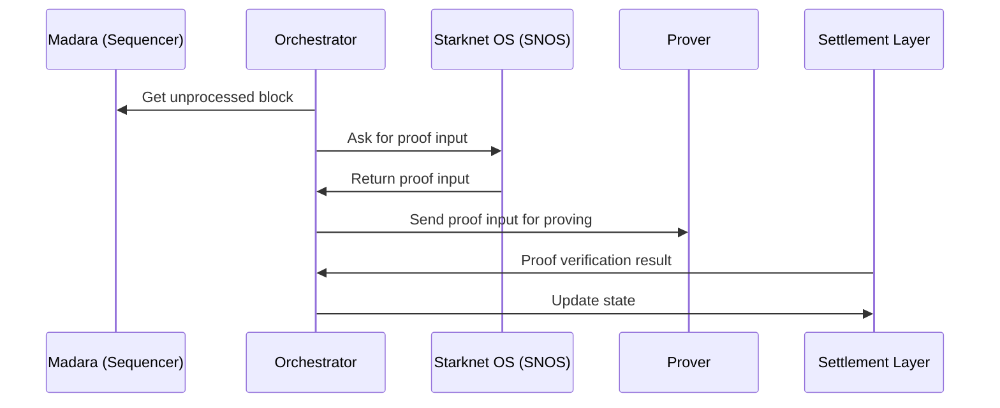

# Orchestrator

## Overview

The orchestrator in a Madara Appchain is responsible for coordinating communication between the sequencer, prover and settlement layer. It can be considered as an extension to the sequencer: it offloads a lot of the communication complexities, making the sequencer lighter.

The orchestrator is a unique component in Madara [Appchains](/concepts/appchain).

## Responsibilities

The orchestrator has four main responsibilities:

1. SNOS communication. Asks SNOS to process ready blocks and retrieve results.
1. Proof coordination. Sends the required data to the prover and monitors for ready proofs.
1. DA communication. Submits data for Data Availability Layer (currently Ethereum or Starknet).
1. SL communication. Submits data for Settlement Layer: proofs and state updates.

All of the responsibilities are handled through a individual queues: jobs enter the appropriate queue and are processed in the order they arrived. Possible retries are also managed through the queues.

## Data flow

The data flow of the orchestrator is illustrated below.

1. The orchestrator polls the sequencer for new, unprocessed blocks
1. Once an unprocessed block is available, the orchestrator asks the SNOS to process the block number
1. The SNOS processes the block, generates a validity proof and sends it to the orchestrator
1. The orchestrator forwards the validity proof (and other metadata) for the prover to process
1. The prover sends ready proofs to the Settlement Layer. The orchestrator polls the Settlement Layer for new, verified proofs.
1. Once the orchestrator detects a new, verified proof in the Settlement Layer, the orchestator updates its state and sends the new state to the Settlement Layer's core contracts for updating their network state.

## Read more

- [Orchestrator Github](https://github.com/madara-alliance/madara-orchestrator)
