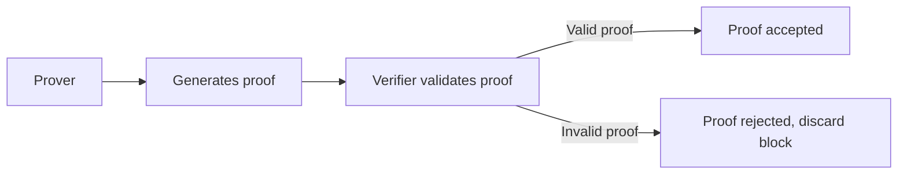
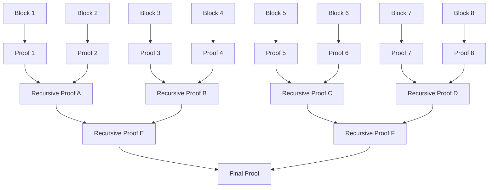

# Prover

## Overview

A prover is a program that generates cryptographic proofs of computation. What exactly is proved depends on the context.

In Madara, the prover calculates validity proofs for a block, providing mathematical guarantees of the block's correctness.

## Responsibilities

The responsibilities of a Madara prover are the following:
1. Generate valid proofs for the given input.
1. Post the proofs to the [Settlement Layer](/concepts/settlement) for verification.

Generating a proof is an expensive operation in terms of computational complexity and required hardware resources. Depending on the input size and proof complexity, generating a proof may take anything between a second and a day.

## A prover requires a verifier

The prover's job is to generate proofs. For the proofs to be useful, the system requires also a separate verifier program that validates them.

Typically, when one writes a prover program, they also generate a verifier program for it. One verifier can often verify proofs only from one prover program - the programs are tightly coupled.

While proof generation can be a very costly operation, proof verification is very cheap. Even if it takes a day to generate a proof, it may require just some milliseconds to verify it.

## Proving process

Before the prover starts generating a proof for a block, the block's transactions are executed with a [Cairo](https://starkware.co/cairo/) program through the [orchestrator](/components/orchestrator). This execution returns a record of all performed operations - this record is usually called a *trace*.

After generating the trace, the prover performs the following steps for each block:
1. Receive the trace and other metadata as input.
1. Calculate a cryptographic proof for the block.
1. Submit the proof to the settlement layer for verification.

If the proof is not valid, the proof is rejected and the block is considered invalid in the Appchain. The included transactions are reverted.

### Proofs in Madara

While proofs provide many guarantees, some key examples include:
- The trace followed all of the network's rules. For example, a smart contract is only allowed to modify its own storage.
- The network state after the block's execution is correctly derived from both the previous state and the trace execution.
- Every transaction in the block was executed exactly once and in the correct order.

Therefore, the prover is the entity guaranteeing the blockchain's integrity - it's there to make sure everyone follows the rules.

:::info
In a production  environment, the prover can't enforce all of the network rules by itself. Therefore, a few more steps are needed, but those are left out for simplicity.
:::

## How proofs help chains scale

Blockchains are typically secure because every node verifies each transaction. However, this does not scale well - you can't expect each node to keep up with an ever increasing amount of transactions.

To circumvent this issue, we generate a proof of the transaction's (and block's) execution and let each node verify this proof instead of re-executing each transaction. Verifying a proof is a lot faster process.

This technique is especially well suited for [Appchains](/concepts/appchain) since we can do the heavy operations (the proving) off-chain and only verify proofs on-chain, in the settlement layer.

## Proof posting frequency

If a transaction is sent on chain, the transaction gets finalized only when its proof is verified on the settlement layer. Unfortunately, proofs are typically not posted on the settlement layer every block.

Sending data to the settlement layer is expensive, and a single proof requires quite much data. It would cost a lot to post a proof per block. Therefore, a tradeoff needs to be made: proofs are posted only every X blocks. 

This affects transaction finality and costs directly: the longer this delay is, the longer it takes to finalize transactions, but the cheaper they become. The cost reductions result from sending less data to the settlement layer.

It is important to note that the frequency does not influence security. A small proof has the same security guarantees as a big proof containing many small ones.

### Recursive proofs

A typical proof includes data only for a single block. A different mechanism is needed to aggregate multiple proofs to be sent simultaneously to the settlement layer.

Proof recursion helps aggregate multiple proofs into one. The process works like the following:
1. Normal proofs are generated individually for multiple, consecutive blocks.
1. Once enough proofs are generated, they are divided into batches. Batch size depends, but is typically something between 2 and 32 proofs.
1. A new proof is generated for each batch. This new proof proves, recursively, that each underlying proof is correct.
1. New batches are formed and proved until there is only one final proof left.

This final proof is then sent to the settlement layer for verification. Naturally, the settlement layer verifier needs to support verifying recursive proofs.

*A recursive proof chart with batch size 2*

## Proof system security

The prover utilizes Zero Knowledge technology to generate proofs. The benefits of this approach were discussed earlier but there are additional security and liveness considerations.

### How many provers are needed

In a fully decentralized blockchain, there is no single point of failure. The same applies for the provers: there should be more than one.

However, having just a single prover is not very dangerous either. One prover is a single point of failure because it may just go offline. But that's the worst that can happen: it may just stop producing new proofs, halting the network.

A malicious prover (or provers) can't do any real harm to the network. They can generate arbitrary proofs, but the verifier would not accept these proofs. Therefore, in order to corrupt the network, an attacker would need to replace both the prover(s) and the verifier(s).

### How immutability helps

In the end, a lot of the security depends on correct implementations of the prover and verifier.

The verifier program is often deployed on a blockchain to be immutable. This brings a few benefits:
1. The code can't be changed.
1. Everyone knows they are using the same verifier program.

Verifying that the on-chain verifier does what it should do is generally achieved in one of two ways:
1. Audit the verifier's code to ensure correctness. This is very costly.
1. Social consensus. Once enough users have used the verifier for long enough, with no problems, users start to trust it.

## Prover options

In theory, one can use any ZK prover that accepts inputs in the desired format. However, most provers do not have the needed tooling available.

Madara highly encourages using a prover that is compatible with existing tooling. Currently the main compatible prover is called [Stone](https://github.com/starkware-libs/stone-prover). Other prover options are being built but are not yet ready, such as [Stwo](https://github.com/starkware-libs/stwo).

To utilize the Stone prover, it's easiest to use a service called [Atlantic](https://atlanticprover.com/). The service also posts the ready proofs to the settlement layer automatically. Madara suggests Atlantic when starting an Appchain.

## Read more

- [About ZK proofs](https://ethereum.org/en/zero-knowledge-proofs/)
- [About Starknet provers](https://docs.starknet.io/architecture-and-concepts/provers-overview/)
- [About recursion](https://www.starknet.io/blog/recursive-starks/)