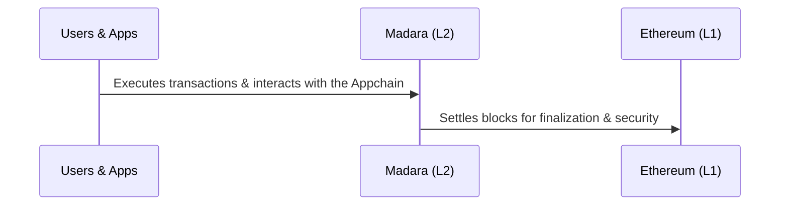
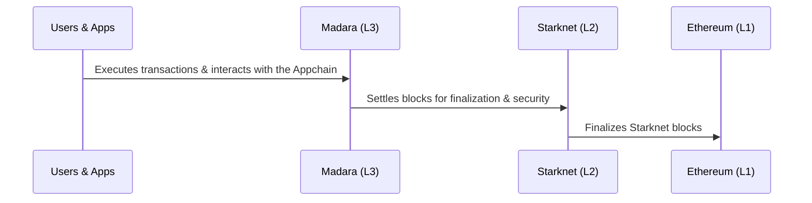

# Appchain

The term Appchain is short for Application Chain. As the name suggests, an Appchain is a blockchain built for a single application or a limited number of applications.

An Appchain is built on top of some existing blockchain. Madara's Appchains run on top of either Starknet or Ethereum and settle their transactions there, for added security.

## Components

An Appchain is formed by multiple components. In Madara, the main components are:
- A gateway. Receives user transactions and forward these to a sequencer.
- A sequencer. Forms blocks of transactions and provides access to the blockchain for users.
- An [orchestrator](/components/orchestrator). Coordinates communication between entities.
- A prover. Generates cryptographic proofs of a block's validity.
- A verifier. Verifies generated proofs.
- A [settlement layer](/concepts/settlement). Records verified proofs and their data, providing security for the Appchain.

## Why use an Appchain

What are the benefits of running an Appchain and why should you care?

### Your chain with your own rules

Modern, major blockchains are secure. But they are typically expensive to use and have a lot of limitations.

When you start an Appchain, you can have very different cost tradeoffs. You can optimize the Appchain to suit your specific performance requirements.

The absolute minimum requirements for an Appchain are to run a single sequencer and nothing else. Such a chain may be useful for quick experimentation but includes zero security and is maximally centralized. But here again you are free to choose what you require.

## Settling transactions and security

Appchains typically inherit security from the underlying, secure blockchain, by settling transactions on it. For Madara, this blockchain is either Ethereum or Starknet.

For Starknet, the underlying blockchain is Ethereum. In this setting, Starknet is called a Layer 2 (L2) blockchain, while Ethereum is Layer 1 (L1). It's also equally possible to create an Appchain on top of Starknet - then your new layer becomes a L3 and your transactions are settled on Starknet L2, which again settles transactions on Ethereum L1.

### Settling when Madara is used as L2

The following diagram shows how settlement works when Madara is used as an L2 Appchain that settles on Ethereum. This is the default configuration.

### Settling when Madara is used as L3

In the near future, Madara can also be used as an L3 (or any layer beyond 2) Appchain. The below diagram shows how settlement works when Madara is used as an L3 settling on Starknet L2.

### Transaction flow

A transaction in an Appchain follows the following flow:
1. It's received by a sequencer.
1. It's included in a block.
1. A cryptographic proof of validity is generated for the block.
1. This proof, along with a record of the new blockchain state, is sent to the underlying blockchain for verification.
1. The proof is verified. If the verification passes, the block is considered valid and nodes in the Appchain consider the corresponding block finalized.

Once the block with our transaction is verified in the underlying blockchain, the transaction is considered settled - its validity is stored in the blockchain.

You can check the full transaction flow in the [architecture page](/components/architecture).

### Escape hatch mechanism

Appchains can be insecure. They may be centralized, unstable, or even disappear entirely.

If the Appchain faces downtime or disappears altogether, users risk losing all assets within it. However, this is where the value of settling transactions on a secure underlying blockchain becomes meaningful.

Because all of the transactions are settled on the settlement layer, asset recovery may be possible, but only under specific conditions:
1. Data availability. All required data must be accessible on the settlement layer or another data availability layer.
1. Implementation. A functional recovery mechanism must exist and be available.

In practice, very few Appchains implement a working escape hatch. While theoretically possible, it is difficult to design and execute effectively.

Despite these challenges, the concept of recovering assets through the underlying chain is known as the escape hatch mechanism. It represents a key way in which an Appchain can inherit security guarantees from its settlement layer.

## Also known as ZK rollups or Validity rollups

Appchains are also known as rollups. They batch transactions and "roll them up" to the underlying blockchain. In the case of Madara, these rollups utilize Zero Knowledge technology, and are therefore sometimes called ZK rollups.

### ZK is misleading

However, the term "Zero Knowledge" is rather misleading. In academic circles, it refers to strict privacy properties, where the receiver of a ZK proof learns nothing about the underlying data (the transactions and blocks) except that they're valid, according to the system's rules.

Madara's Appchains (just like Starknet itself) do not, however, provide such privacy properties. They only utilize the same ZK technology, without implementing the actual ZK properties. This is why the term ZK rollup is avoided, even if it has become popular in certain circles.

The preferred term for this kind of a rollup is `Validity rollup` - it proves the validity of some data while still rolling up the data.

## How to start

It requires work and know-how to start an Appchain. Madara makes the process much smoother, but you still need to understand what you are doing - and what you want to be doing.

You should start by familiarizing yourself with running an Appchain locally, with Madara. Understand how the components work together and learn to configure them to suit your needs. Later, we will post detailed guides on how to start your Appchain and on how to configure it.