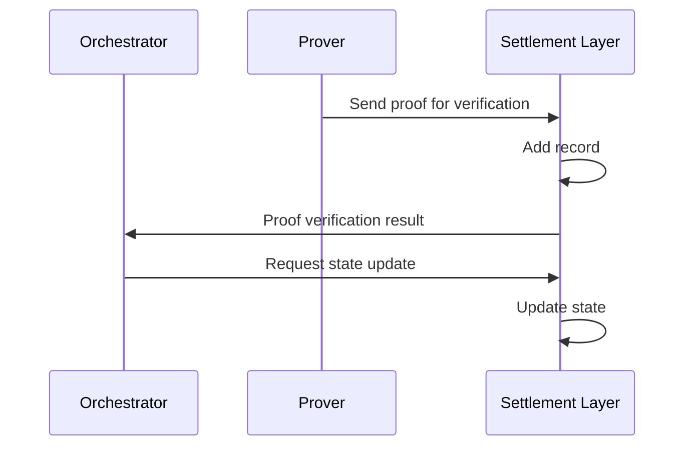

# Settlement

## Overview

In the context of [Appchains](/concepts/appchain), settlement refers to finalizing transactions on a secure blockchain. Settled transactions are verified and their integrity is guaranteed by the blockchain where settlement happens.

Because settlement happens on another blockchain, outside the Appchain itself, the other blockchais is said to be the *settlement layer* for the Appchain.

## Settling transactions

Appchains typically inherit security from the settlement layer blockchain. For Madara, this blockchain is either Ethereum or Starknet.

For Starknet, the underlying blockchain is Ethereum. In this setting, Starknet is called a Layer 2 (L2) blockchain, while Ethereum is Layer 1 (L1). It's also equally possible to create an Appchain on top of Starknet - then your new layer becomes a L3 and your transactions are settled on Starknet L2, which again settles transactions on Ethereum L1.

### Provided security

Settlement layer provides security for the Appchain. This means that even if the Appchain becomes unavailable or malicious, users can retrieve their funds using the [state diff](https://docs.starknet.io/architecture-and-concepts/network-architecture/data-availability/#introduction) and ZK proof stored on the settlement layer.

Without a settlement layer user assets could some day disappear with the Appchain.

## Madara flow

With Madara, the settlement layer is utilized directly by the prover and the orchestrator.

1. The used prover sends a validity proof to the settlement layer
1. The settlement layer's verifier program verifies the proof. If valid, adds a record to an on-chain proof registry.
1. The orchestrator monitors for new verifications. Once it sees one, it asks settlement layer's core contracts to update their network state.

## Cost tradeoffs

A very secure settlement layer blockchain makes fraud very difficult. One would either need to infiltrate the settlement layer or to break the underlying cryptography. If the settlement layer is Ethereum, fraud requires controlling over 33% of its nodes. And breaking the cryptographic principles may not be possible even in theory.

On the other hand, very secure chains are usually expensive to use.

### Alternatives

An alternative approach is to use a specialized network for settlement. Such networks are for example [Celestia](https://celestia.org/) and [Avail](https://www.availproject.org).

Using specialized networks makes settlement a lot cheaper, but requires custom implementation. Madara is built to allow the developers to choose their preferred settlement layer.

## Settlement layer requirements

The settlement layer requires a few key components to serve Madara appchains. The components are:

- A Zero Knowledge proof verifier contract that ensures that only valid state updates are accepted on the settlement layer.
- A Starknet core contract that manages state updates. The contract should be either on [Ethereum](https://docs.starknet.io/architecture-and-concepts/network-architecture/os/#os-and-core-contract) or on [Starknet](https://github.com/keep-starknet-strange/piltover/), depending on which is the used settlement layer.

While Madara and Starknet rely on validity proofs (with ZK), some other appchains settle via fraud proofs, where incorrect state updates can be challenged within a dispute period. Fraud proofs rely on completely different technologies and are not related to Madara directly.

### Requirements for a good Settlement Layer

Requirements for a good settlement layer network are:
- Secure. The used network has to be financially secure and trusted by all involved parties.
- Availability. The used network has remain operational and available.
- Programmability. The used network has to be able to run the settlement logic.
- Finality guarantees. The used network must provide strong finality guarantees to prevent state rollbacks.
- Governance & development stability. The used network should be stable enough to support ongoing settlement.

For convenience, the settlement layer is often a multipurpose blockchain. But, as noted earlier, it can also be a specialized network.

## Read more

- https://ethereum.org/en/developers/docs/scaling/zk-rollups/#transaction-finality
- Chapter 4 of https://www.starknet.io/what-is-starknet/