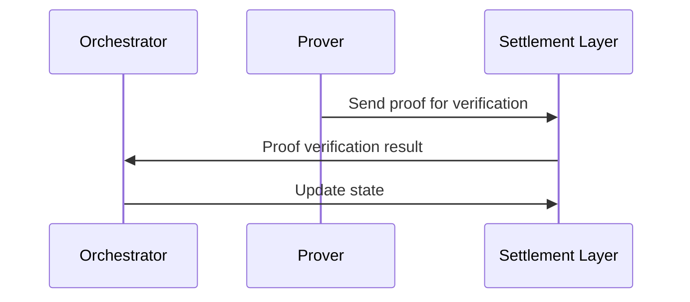

# Settlement Layer

## Overview

A settlement layer is a blockchain where transactions from an [Appchain](/concepts/appchain) are finalized. It ensures security, dispute resolution and finality by verifying provided proofs from the Appchain.

The most common settlement layer is Ethereum mainnet.

## Settling transactions and security

Appchains typically inherit security from the settlement layer blockchain. For Madara, this blockchain is either Ethereum or Starknet.

For Starknet, the underlying blockchain is Ethereum. In this setting, Starknet is called a Layer 2 (L2) blockchain, while Ethereum is Layer 1 (L1). It's also equally possible to create an Appchain on top of Starknet - then your new layer becomes a L3 and your transactions are settled on Starknet L2, which again settles transactions on Ethereum L1.

### Provided security

Settlement layer provides security for the Appchain. This means that even if the Appchain becomes unavailable or malicious, users can retrieve their funds using the [state diff](https://docs.starknet.io/architecture-and-concepts/network-architecture/data-availability/#introduction) and ZK proof stored on the settlement layer.

Without a settlement layer user assets could some day disappear with the Appchain.

## Cost tradeoffs

A very secure settlement layer blockchain makes fraud difficult. On the other hand, very secure chains are usually expensive to use.

It is possible to utilize a layer that is more specialized for settling transactions and is a lot cheaper to use. Such integrations typically require custom implementation that's only valid for that network. Choosing the right layer requires careful consideration.

Often the state diff data is posted in the same settlement layer, but this does not have to be the case. There are also separate data availability networks built specifically for this purpose.

## Required components in the settlement layer

The settlement layer requires a few key components to serve Madara appchains. The components are:

- A Zero Knowledge proof verifier contract that ensures that only valid state updates are accepted on the settlement layer.
- A starknet core contract that manages state updates. Either on [Ethereum](https://docs.starknet.io/architecture-and-concepts/network-architecture/os/#os-and-core-contract) or on [Starknet](https://github.com/keep-starknet-strange/piltover/).

## Madara flow

With Madara, the settlement layer is utilized directly by the prover and the orchestrator.

1. The used prover sends a validity proof to the settlement layer
1. The settlement layer's verifier program verifies the proof. If valid, adds a record to an on-chain proof registry.
1. The orchestartor monitors for new verifications. Once it sees one, it asks settlement layer's core contracts to update their network state.

## Settlement layer requirements

Requirements for a good settlement layer are:
- Secure. The blockchain has to be financially secure and trusted by all involved parties.
- Programmability. The blockchain has to be able to run the settlement logic.
- Governance & development stability. The chain should be stable enough to support ongoing settlement.

The blockchain is typically a multipurpose chain - it's not specialized for settlement.

## Read more

